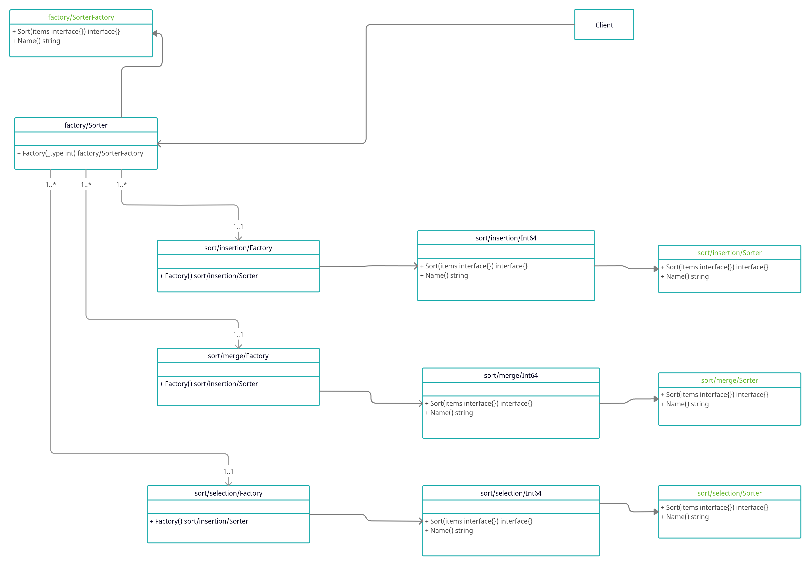

## Домашнее задание «Расширяемая фабрика и IoC»

Данные задаются в файле. Результат также помещается в файл.

1. Выбрать массив размером 50 элементов.
2. Создать программу, которая в качестве входного параметра получает вариант сортировки (выбором, вставки, слиянием), имя файла со входным набором данных и имя файла с выходными данными.
3. Реализовать в программе абстрактную фабрику и конкретные фабрики, отвечающие за каждый вариант сортировки как продукты.
4. Программа записывает результаты в выходной файл данных. В содержании в пишется тип сортировки и результаты.
5. Если потребуется использовать абстрактную фабрику или фабричный метод в проектной работе, предоставить описание в текстовом файле в GitHub репозитории где конкретно и в какой роли используется этот шаблон.
6. нарисовать диаграмму классов.

### Использование в проектной работе
Проектная работа еще не продумывалась

### Диаграмма классов

